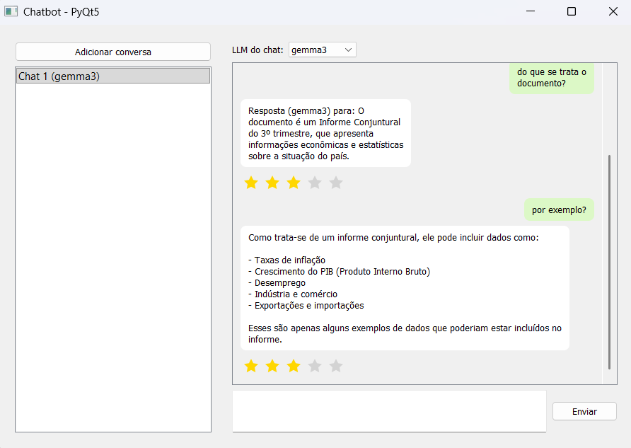

# Add-on Orange3 Chatbot

Um add-on para Orange3 que fornece um chatbot interativo com capacidades de Retrieval-Augmented Generation (RAG) através de uma arquitetura modular.



## Recursos

- **Arquitetura Modular de 3 Widgets**: RAG, LLM e Chatbot trabalham juntos sequencialmente
- **Interface de Chat Interativa**: Chatbot completo com histórico de conversação
- **Suporte RAG**: Vetorização e recuperação de documentos para respostas com contexto
- **Múltiplas Opções de LLM**: Suporte para vários modelos de linguagem (Gemma, GPT-4o, Llama, etc.)
- **Sistema de Avaliação por Estrelas**: Avalie respostas do bot para rastreamento de qualidade
- **Parâmetros de LLM Configuráveis**: Ajuste temperatura, tokens máximos e streaming
- **Integração com Orange3**: Fluxo de dados completo
  - Widget RAG: Documentos → Recuperador
  - Widget LLM: Recuperador → Config LLM  
  - Widget Chatbot: Config LLM → Histórico de conversação como Orange Table

## Instalação

### Pré-requisitos

- Orange3 (>= 3.31.0)
- Python 3.9.25
- [Ollama](https://ollama.ai/download) (para suporte LLM local) com modelos:
  - `llama3.1:8b` - Modelo de linguagem
  - `znbang/bge:small-en-v1.5-f32` - Modelo de embedding

Para instruções de instalação, consulte [INSTALL.md](INSTALL.md).

## Uso

### No Orange3

O chatbot requer os três widgets conectados em sequência:

1. Abra o Orange3
2. Procure a categoria "Chatbot" na caixa de ferramentas de widgets
3. Monte o fluxo de trabalho completo:
   - **Widget RAG**: Vetoriza documentos e cria recuperador
   - **Widget LLM**: Recebe recuperador e configura modelo de linguagem
   - **Widget Chatbot**: Recebe configuração LLM e fornece interface de chat

**Fluxo de Trabalho Completo:**
```
[RAG] → [LLM] → [Chatbot]
```

Os três widgets devem ser conectados nesta ordem para o chatbot funcionar corretamente.

### Visualização Standalone do Widget

Os widgets podem ser visualizados individualmente:

```bash
cd orangecontrib/chatbot/widgets
python owchatbot.py  # Widget Chatbot
python owllm.py      # Widget LLM
python owrag.py      # Widget RAG
```

### Aplicação Standalone (Legado)

A aplicação standalone original ainda está disponível:

```bash
# Modo de produção (com LLM)
python chatbot_new.py
```

## Configuração

### Backend LLM

O chatbot usa Ollama por padrão. A configuração está em `orangecontrib/chatbot/rag_backend.py`:

- Localização do banco de dados vetorial: `./vector_store`
- Modelo LLM: `llama3.1:8b`
- Modelo de embedding: `znbang/bge:small-en-v1.5-f32`
- Janela de contexto: 4096 tokens
- Recuperação: Top 2 pedaços relevantes

### Ingestão de Documentos

Coloque documentos PDF na pasta `input/`, ou use o botão "Add Documents" no widget. Documentos são vetorizados automaticamente na inicialização.

## Integração com Fluxos de Trabalho do Orange3

### Arquitetura dos Widgets

O add-on fornece três widgets interconectados:

#### 1. Widget RAG
**Propósito:** Vetorização e recuperação de documentos
- **Entradas:**
  - Documents (Table): Dados de documentos para vetorizar
- **Saídas:**
  - Retriever (object): Recuperador da base vetorial
- **Configurações:**
  - Tamanho e sobreposição de pedaços
  - Contagem de recuperação top-k

#### 2. Widget LLM
**Propósito:** Configuração do modelo de linguagem
- **Entradas:**
  - Retriever (object): Recuperador do widget RAG
- **Saídas:**
  - LLM Config (dict): Modelo de linguagem configurado
- **Configurações:**
  - Seleção de modelo (Gemma, Llama, GPT-4o, etc.)
  - Temperatura, tokens máximos
  - Modo streaming

#### 3. Widget Chatbot
**Propósito:** Interface de chat interativa
- **Entradas:**
  - LLM Config (dict): Modelo de linguagem do widget LLM
- **Saídas:**
  - Conversations (Table): Histórico de chat com metadados
    - `chat_id`: Identificador da conversação
    - `user_message`: Mensagem de entrada do usuário
    - `bot_response`: Resposta do bot
    - `llm_used`: Qual modelo LLM foi usado
    - `rating`: Avaliação do usuário (1-5 estrelas)
- **Configurações:**
  - Auto-commit de dados de conversação

### Exemplos de Fluxos de Trabalho

**Fluxo de Trabalho Completo:**
```
[RAG] → [LLM] → [Chatbot]
```

Os três widgets (RAG, LLM, Chatbot) devem ser conectados em sequência para o sistema funcionar.

Use os dados de conversação para:
- Análise de desempenho do chatbot
- Coleta de dados de treinamento
- Avaliação de qualidade
- Padrões de interação do usuário

## Configurações dos Widgets

### Widget RAG
- **Chunk Size**: Tamanho dos pedaços de texto para vetorização (padrão: 500)
- **Chunk Overlap**: Sobreposição entre pedaços (padrão: 50)
- **Top-K**: Número de pedaços relevantes a recuperar (padrão: 2)
- **Add Documents**: Carregar documentos PDF do sistema de arquivos

### Widget LLM
- **Model Selection**: Escolher modelo de linguagem (Gemma, Llama, GPT-4o, etc.)
- **Temperature**: Controlar aleatoriedade da resposta (0.0-2.0)
- **Max Tokens**: Comprimento máximo da resposta (512-32768)
- **Streaming**: Ativar/desativar respostas em streaming

### Widget Chatbot
- **Auto-commit**: Enviar automaticamente dados de conversação para saídas
- **Chat Interface**: Campo de entrada, histórico de conversação e avaliações por estrelas

## Estrutura do Projeto

```
orange3-chatbot/
├── orangecontrib/           # Pacote do add-on Orange3
│   └── chatbot/
│       ├── __init__.py      # Metadados do pacote
│       ├── rag_backend.py   # Implementação RAG
│       └── widgets/
│           ├── __init__.py  # Metadados dos widgets
│           ├── owchatbot.py # Widget Chatbot
│           ├── owllm.py     # Widget de configuração LLM
│           ├── owrag.py     # Widget de documentos RAG
│           └── icons/
│               ├── chatbot.svg
│               ├── llm.svg
│               └── rag.svg
├── chatbot_new.py           # Aplicação standalone (legado)
├── rag_backend.py           # Backend RAG (legado)
├── conversas.csv            # Histórico de conversação
├── setup.py                 # Configuração de instalação
├── MANIFEST.in              # Manifesto do pacote
├── requirements.txt         # Dependências Python
└── README.md               # Este arquivo
```

## Desenvolvimento

### Configuração de Depuração no VS Code

O projeto inclui `.vscode/launch.json` com configurações:
- **"Python: Chatbot (Production)"** - Executa app standalone com LLM
- **"Python: Orange Widget Preview"** - Visualiza widgets individuais do Orange3

## Requisitos

### Dependências Principais
- Orange3 >= 3.31.0
- PyQt5 >= 5.12.0
- langchain-community
- chromadb
- pypdf
- ollama (para LLM local)

## Solução de Problemas

Para solução de problemas de instalação, configuração e execução, consulte [INSTALL.md](INSTALL.md#solução-de-problemas).

## Licença

Licença MIT

## Contribuindo

Contribuições são bem-vindas! Por favor, envie pull requests ou abra issues no GitHub.

## Créditos

Criado com:
- [Orange3](https://orangedatamining.com/) - Programação visual para ciência de dados
- [LangChain](https://www.langchain.com/) - Framework de aplicações LLM
- [ChromaDB](https://www.trychroma.com/) - Banco de dados vetorial
- [Ollama](https://ollama.ai/) - Runtime LLM local

## Suporte

Para problemas e questões:
- GitHub Issues: https://github.com/yourusername/orange3-chatbot/issues
- Fórum Orange3: https://orange.biolab.si/forum/

## Registro de Mudanças

### 0.1.0 (2026-02-20)
- Lançamento inicial do add-on Orange3
- Arquitetura modular de três widgets (RAG, LLM, Chatbot)
- Chatbot standalone convertido em widgets Orange3
- Integração com fluxos de trabalho Orange3 com ligação flexível de widgets
- Capacidades RAG completas com vetorização e recuperação de documentos
- Parâmetros de LLM configuráveis (temperatura, tokens máximos, streaming)
- Sistema de avaliação por estrelas para qualidade de resposta
- Exportação de histórico de conversação para Orange Table
