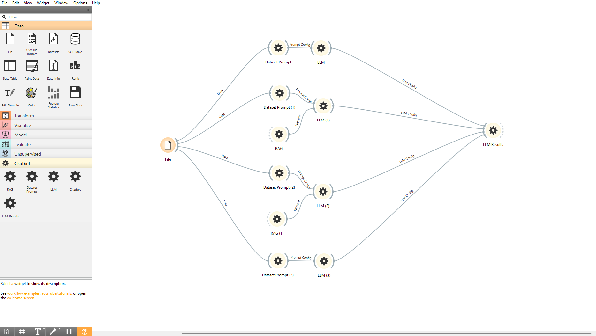

orange-widgets-llm
# Descrição

O orange-widgets-llm é um conjunto de widgets desenvolvidos para o Orange Data Mining com o objetivo de facilitar a criação de fluxos de avaliação utilizando Large Language Models (LLMs).


# Recursos

Atualmente o projeto oferece os seguintes recursos:

- Widgets personalizados para o Orange Data Mining;
- Integração com modelos de linguagem executados através do Ollama;
- Execução de múltiplas LLMs em um mesmo workflow;
- Suporte opcional à utilização de RAG para enriquecimento de contexto;
- Processamento de datasets contendo perguntas e respostas;
- Avaliação das respostas geradas pelas LLMs através de métricas;
- Construção de fluxos visuais utilizando widgets do Orange.


# Pré-requisitos

Antes de utilizar o projeto, certifique-se de possuir os seguintes requisitos instalados:

- Python 3.9 ou superior;
- Orange Data Mining 3.38.1 ou superior;
- Ollama;
- Git (opcional, para clonar o repositório).

> **Ambiente utilizado durante o desenvolvimento**
>
> - Windows 11
> - Python 3.9.25
> - Orange Data Mining 3.38.1


# Instalação

Siga os passos abaixo para configurar o ambiente e instalar o projeto.

## 1. Clone o repositório

Clone o repositório para sua máquina utilizando o Git:

```bash
git clone https://github.com/tppagano/orange-widgets-llm
```

## 2. Acesse o diretório do projeto

Navegue até o diretório onde o repositório foi clonado.

Exemplo:

```bash
cd orange-widgets-llm
```

## 3. Crie um ambiente virtual

Embora não seja obrigatório, recomenda-se utilizar um ambiente virtual para evitar conflitos entre dependências.

Crie o ambiente virtual:

```bash
python -m venv .venv
```

Ative o ambiente.

### Windows

```bash
.venv\Scripts\activate
```

### Linux / macOS

```bash
source .venv/bin/activate
```

## 4. Instale o Orange Data Mining

Caso ainda não possua o Orange Data Mining instalado, execute:

```bash
pip install Orange3
```

Ou siga as instruções disponíveis na documentação oficial do Orange.

## 5. Instale as dependências

Instale todas as dependências necessárias utilizando o arquivo `requirements.txt`:

```bash
pip install -r requirements.txt
```

## 6. Instale o add-on

Com as dependências instaladas, execute:

```bash
pip install -e .
```

Esse comando instala o projeto em modo editável, permitindo que alterações no código sejam refletidas imediatamente sem a necessidade de reinstalação.

## 7. Instale o Ollama

Faça o download e instale o Ollama seguindo as instruções disponíveis em seu site oficial.

> **Observação:** O gerenciamento dos modelos de linguagem é realizado diretamente pelos widgets do projeto.

## 8. Execute o Orange Data Mining

Após concluir a instalação, abra o Orange Data Mining.

Caso tenha instalado o Orange via `pip`, também é possível iniciá-lo pelo terminal utilizando:

```bash
orange-canvas
```

Os widgets do projeto estarão disponíveis na caixa de ferramentas do Orange.

# Estrutura do Projeto

A organização do projeto segue a estrutura abaixo:

```text
orange-widgets-llm/
│
├── orangecontrib/
│   └── llm/
│       ├── widgets/
│       ├── utils/
│       ├── resources/
│       └── ...
│
├── screenshots/
├── requirements.txt
├── setup.py
├── README.md
└── ...
```

### Principais diretórios

| Diretório | Descrição |
|------------|-----------|
| `orangecontrib/` | Código-fonte do add-on e widgets personalizados do Orange. |
| `widgets/` | Implementação dos widgets do projeto. |
| `utils/` | Funções auxiliares utilizadas pelos widgets. |
| `resources/` | Recursos utilizados pela interface, como ícones e arquivos auxiliares. |
| `screenshots/` | Imagens utilizadas na documentação do projeto. |


# Guia de Utilização

Após concluir a instalação, o projeto pode ser utilizado através do Orange Data Mining por meio da criação de workflows utilizando os widgets disponibilizados pelo add-on.

O fluxo básico de utilização consiste nas seguintes etapas:

1. Abrir o Orange Data Mining.
2. Criar um novo workflow.
3. Adicionar o widget **File** para carregar o dataset.
4. Adicionar o widget **Dataset Prompt** e conectá-lo ao widget **File**.
5. Adicionar um ou mais widgets **LLM** e conectá-los ao **Dataset Prompt**.
6. (Opcional) Inserir um widget **RAG** para enriquecer o contexto utilizado pela LLM.
7. Conectar todos os widgets **LLM** ao widget **LLM Results**.
8. Executar o workflow e analisar os resultados obtidos.


### Exemplo de Workflow

<p align="center">
  
</p>

# Licença

Este projeto ainda não possui uma licença definida.
